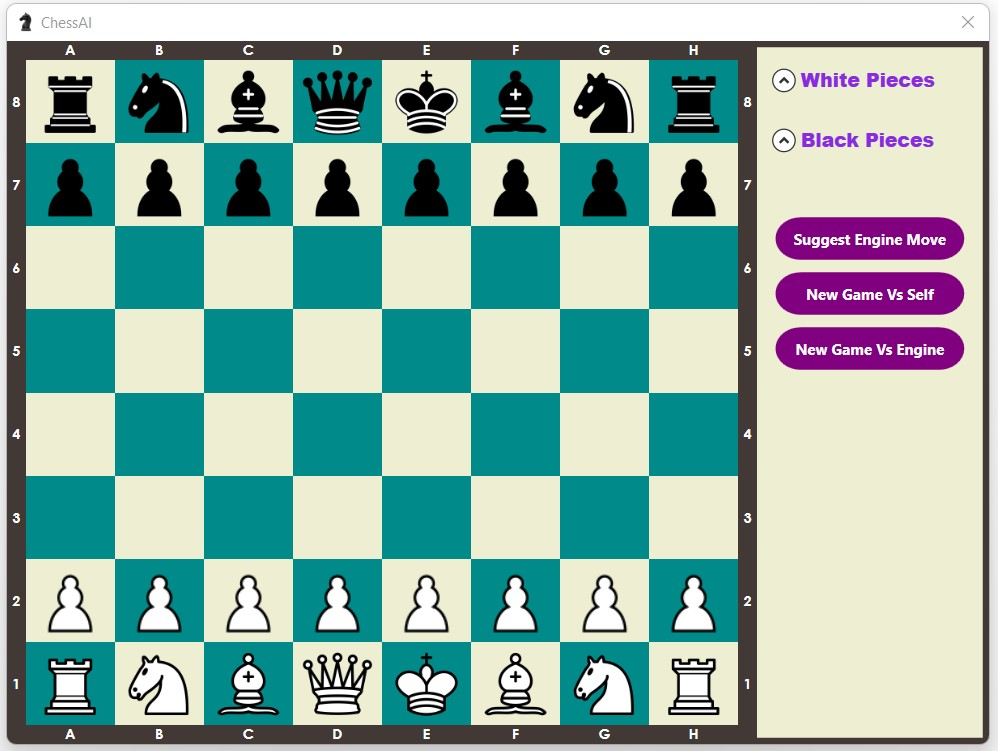

ChessAI
=======
A personal implementation of a chess game using the **WPF** (Windows Presentation Forms) framework from .NET

The game implements the **MVVM design Pattern**. 

The focus in this project was to implement AI algorithms in order to build a decent engine. The interface supports basic functionalities to visualize the game.
For the moment, **negamax** and **minimax** were implemented. In the near future, I will be tackling **Monte Carlo Tree Search**.

Run
------
1. In order to play the game, just clone the repository, head to the **target** folder and run the executable file. If you don't have the .NET 6.0 runtime installed on your server, a pop up will lead you to the .NET website, where you can easily download the runtime. Then run the executable again. 
1. You could play the game through the source code by importing the solution to **visual studio** or **visual studio code** and running it.

Interface 
------

